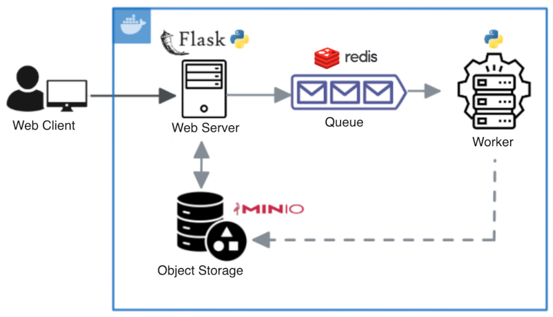
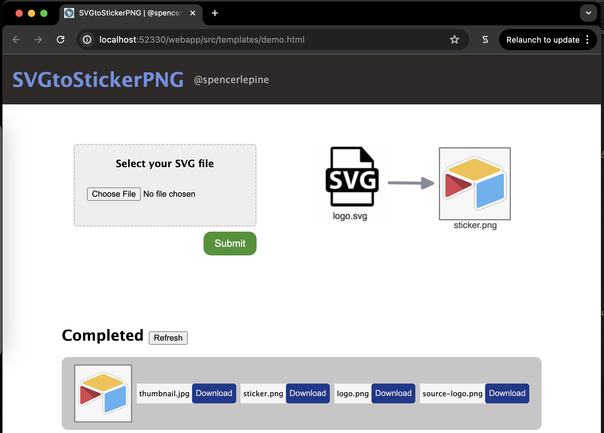

# SVGtoStickerPNG App

   

Webapp for converting SVG logos to sticker PNG files. Processing images with the Python OpenCV library. Built with Flask (server-side rendering + backend), Redis (Messaging Queue), and Minio (object storage).





## Prerequisites

- Docker installed ([documentation](https://docs.docker.com/get-docker/))

## Run Locally

```sh
git clone https://github.com/spencerlepine/svg-to-sticker-png-app.git
cd svg-to-sticker-png-app
docker-compose up
# view: http://localhost:3000
```

## Tech Stack

- Python: v3.9
- Flask: light-weight web-app framework (python) ([documentation](https://github.com/pallets/flask))
- Redis: in-memory message queue ([documentation](https://github.com/redis/redis-py))
- Minio: block storage ([documentation](https://min.io/docs/minio/linux/developers/python/API.html))
- OpenCV: python image manipulation library ([documentation](https://github.com/opencv/opencv-python)) (+ [CarioSVG](https://cairosvg.org/documentation/))
s