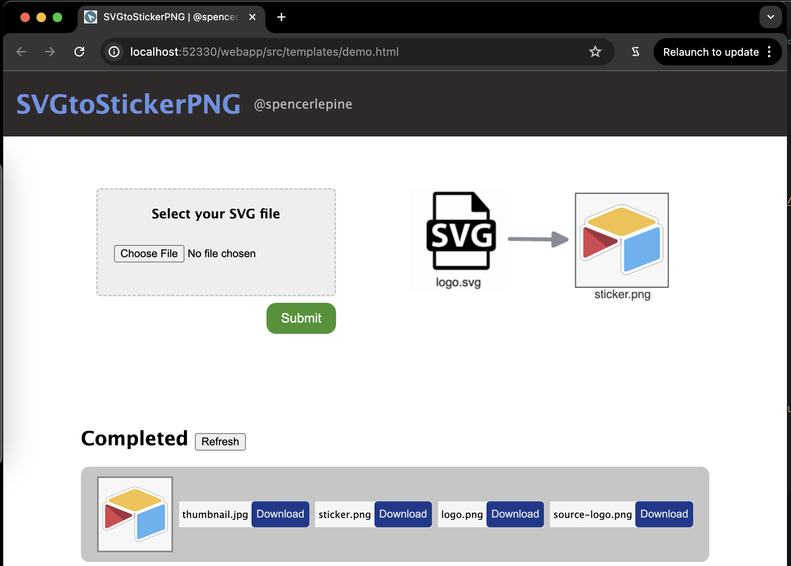

# Flask Webapp (HTML, Python, Flask)

Simple webapp to upload SVG files and view formatted PNG images. Built with Flask, Minio Object Storage, and Redis.



## Local Development

```sh
python3 -m venv .venv && source .venv/bin/activate
pip install -r requirements.txt
```

## Tech Stack

- Python: v3.9
- Flask
- [Flask-WTF](https://flask-wtf.readthedocs.io/): CSRF tokens to protect <form> input
- Redis / Python RQ: publish jobs to messaging queue
