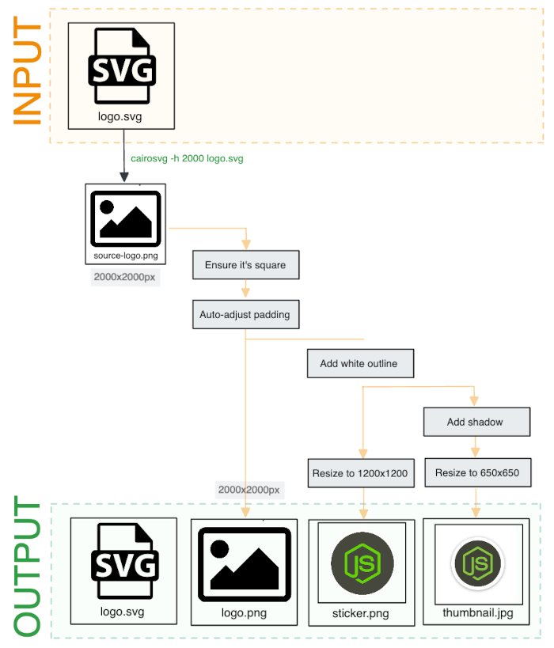

# Image Processing Worker (Python, OpenCV)

Python Worker server listening to the image processing queue. Converts SVG logo files into sticker images, using OpenCV and CairoSVG. Uploads the output PNG file to Minio Block Storage.



## Tech Stack

- Python: v3.9
- Redis RQ: library to subscribe to redis messaging queue
- Minio: block storage ([documentation](https://min.io/docs/minio/linux/developers/python/API.html))
- OpenCV: python image manipulation library ([documentation](https://github.com/opencv/opencv-python)) (+ [CarioSVG](https://cairosvg.org/documentation/))

## Known Issue: Docker Build

To use the `CarioSVG` Pypy library, you need to install the following linux packages: `libcairo2-dev` and `libffi-dev`. This was causing Docker build issues on the M1 Chip Mac.

The `Dockerfile` includes install commands for both `ubuntu` and `debian` to resolve this, depending on your system:

```
# (Ubuntu) Install libraries needed for CairoSVG
# RUN apt-get update && apt-get install -y libcairo2-dev=1.16.0-4ubuntu1 libffi-dev-3.4.6

# (M1 Mac, arch x86) Install libraries needed for CairoSVG
RUN apt-get update && apt-get install -y libcairo2-dev libffi-dev
```